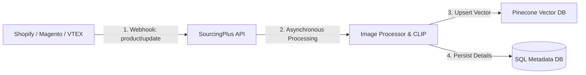

# Strategic Assessment: E-commerce Integration & Scalability

Este documento presenta un análisis estratégico sobre cómo el microservicio **SourcingPlus Visual Search** puede integrarse de manera fluida con las principales plataformas de comercio electrónico del mercado (Shopify, Magento, VTEX, WooCommerce) y cómo debe estructurarse para escalar ante catálogos masivos (>1 millón de SKUs).

---

## 1. Arquitectura de Integración con Ecosistemas de E-commerce

Para ser compatible con las principales plataformas de comercio digital, el microservicio debe operar bajo un enfoque **decoupled/headless (composable commerce)**, actuando como un motor de búsqueda especializado que se integra mediante dos flujos principales:

### A. Sincronización del Catálogo (Event-Driven)
En lugar de depender de cargas manuales, el microservicio debe sincronizarse automáticamente escuchando eventos de cambio en las plataformas.

*   **Shopify (GraphQL Admin API & Webhooks):**
    *   **Ingesta:** Registro de Webhooks para los eventos `products/create`, `products/update` y `products/delete`.
    *   **Sincronización:** Cada vez que el comerciante edita un producto en el panel de Shopify, Shopify envía un JSON al endpoint `/sync` de SourcingPlus, manteniendo actualizados Pinecone y SQLite de forma transparente.
*   **Magento / Adobe Commerce (Enterprise Message Queue):**
    *   **Ingesta:** Conexión mediante colas de mensajería (RabbitMQ) o eventos de Adobe I/O.
    *   **Sincronización:** Magento publica cambios de stock o precio en la cola, y un consumidor de SourcingPlus procesa los mensajes en lotes (*batches*), protegiendo al microservicio de picos de carga.
*   **VTEX (Catalog Feed API & VTEX IO):**
    *   **Ingesta:** VTEX Io permite crear aplicaciones en TypeScript/Node que escuchan los cambios del catálogo y despachan las imágenes al microservicio SourcingPlus en background.

### B. Consumo desde el Frontend (Client-Side API)
La búsqueda visual (*Snap & Shop*) ocurre en el navegador del cliente (móvil o desktop).
-   **Integración en Shopify:** Se encapsula la lógica del buscador visual (como el drag-and-drop y visualización de resultados implementados en la Fase 8) en un **Shopify App Block** (Liquid/React). El cliente final sube la foto directamente desde la tienda y el App Block consulta al microservicio SourcingPlus de forma asíncrona.
-   **Seguridad CORS:** El backend de SourcingPlus debe configurar dinámicamente orígenes permitidos (CORS) que correspondan únicamente a los dominios de la tienda del cliente (ej. `tienda.com`), protegiendo la API de consultas externas no autorizadas.

---

## 2. Puentes de Compatibilidad Estándar (Data Feeds)

Para facilitar la adopción rápida del servicio por parte de cualquier plataforma de e-commerce sin programar integraciones a medida, el microservicio debe admitir formatos de alimentación estándar:

1.  **Google Merchant Center Feed (XML/RSS):**
    *   Casi todas las plataformas de e-commerce exportan un feed XML estructurado para Google Shopping. SourcingPlus puede incluir un endpoint `/sync/google-feed` que lea periódicamente esta URL XML, descargue las imágenes de las etiquetas `<g:image_link>` y asocie los metadatos correspondientes (`<g:price>`, `<g:brand>`).
2.  **Feeds en formato CSV/JSON:**
    *   Soporte para ingestas masivas mediante archivos planos estándar que contengan las columnas básicas: `id`, `sku`, `title`, `price`, `category`, `brand`, `image_url` y `product_url`.

---

## 3. Optimización para Catálogos Masivos (>1 Millón de SKUs)

Cuando una tienda maneja catálogos de gran escala y múltiples categorías, buscar linealmente en toda la base de datos vectorial puede degradar la precisión y la latencia. Estrategias de optimización recomendadas:

### A. Segmentación Vectorial (Namespaces & Metadata Filtering)
-   **Namespaces en Pinecone:** Particionar el índice vectorial por países, tiendas o canales de venta (ej. `namespace="mexico"`, `namespace="colombia"`). Esto reduce el espacio de búsqueda únicamente a los productos disponibles en la región del usuario.
-   **Pre-filtrado por Categoría en Búsqueda:** Utilizar el filtro de categoría (`category`) directamente en la query de Pinecone. Pinecone realiza un filtrado previo de los vectores antes de calcular las distancias de coseno, lo que acelera la respuesta y evita falsos positivos (ej. que una imagen de una camisa roja devuelva un zapato rojo por similitud de color).

### B. Arquitectura de Carga Asíncrona (Celery + Redis)
Para catálogos masivos, el procesamiento secuencial en FastAPI puede saturar los hilos del servidor.
-   Se debe separar la API web del procesamiento de imágenes.
-   El endpoint `/sync` debe simplemente recibir la lista de productos, guardarlos como "pendientes" en la base de datos SQL y encolar las tareas en **Redis**.
-   Trabajadores distribuidos de **Celery** en background toman las tareas, descargan las imágenes en paralelo, calculan los embeddings con CLIP y los suben en bloques eficientes a Pinecone.

### C. Base de Datos Relacional de Producción
Para la fase de desarrollo, **SQLite** es ideal por su portabilidad. Sin embargo, para soportar miles de peticiones de hidratación de datos concurrentes en producción, la base de datos de metadatos relacionales debe migrarse a:
-   **PostgreSQL / Amazon Aurora Serverless**: Ofrece alta capacidad de lectura indexada por el ID del producto, garantizando que el paso de hidratación (recuperar título, marca y link tras la coincidencia visual de Pinecone) ocurra en menos de **5 milisegundos**.
