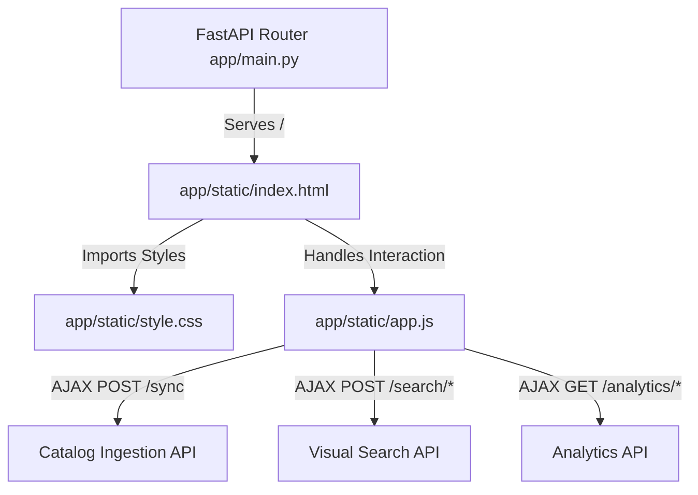

# Implementation Plan - Phase 8: Premium Visual Search Frontend & Admin UI (Corporate Light Theme)

This plan outlines the architecture and execution steps for building Phase 8 of the **SourcingPlus Visual Search Backend**. It focuses on creating a premium, responsive Single-Page Application (SPA) served directly from the FastAPI server, providing a complete interface for visual querying, catalog synchronization, and real-time dashboard analytics.

## Goal Description
Build a premium visual search user interface:
1. **FastAPI Static Serving**: Mount static files in the FastAPI app and redirect the root route (`GET /`) to serve the dashboard SPA.
2. **Consulting Consulting/Corporate Light Theme**: Design a professional, clean, light-themed user interface utilizing deep corporate navy (`#0f172a`), sapphire blue (`#1e3a8a` / `#2563eb`), off-white backgrounds (`#f8fafc`), and clean border layouts with soft, professional card shadows.
3. **Interactive Search Tab**:
   - **Upload & Drag-and-Drop Area**: Support dragging images, pasting image URLs, or clicking to upload local image files.
   - **Multi-query Controls**: Expose parameters for CLIP text blending (`text_query` and `image_weight` slider), price ranges (`min_price` and `max_price`), brand, category, and availability filters.
   - **Hydrated Results Grid**: Show image matching results, similarity scores, pricing, brands, buying links, and cache hit metrics.
4. **Real-time Analytics Tab**:
   - **KPI Metric Cards**: Display total query volumes, cache hit rates, and average latency.
   - **Visual Search Trends**: Display trending products with hits counters and full catalog metadata.

---

## Technical Architecture



---

## User Review Required

> [!IMPORTANT]
> **Single Server Solution**
> Serving the frontend directly from FastAPI avoids introducing CORS configurations or requiring you to manage multiple development servers. Running `python -m uvicorn app.main:app --reload` will spin up the API and the web dashboard simultaneously on port 8000.

> [!TIP]
> **Corporate Light Aesthetics**
> The interface will use the clean **Inter** Google Font, avoiding dark neon styles. It will employ corporate colors (slate gray, navy titles, sapphire accents, and crisp white cards) for a highly polished, consulting-firm presentation.

---

## Proposed Changes

### Component: Server Configuration

#### [MODIFY] [app/main.py](file:///c:/Users/GarciaJ26/OneDrive - AkzoNobel/Mundial - Documents/DASHBOARDS & KPI´s/SourcingPlus-VisualSearch-Backend/app/main.py)
*   Mount static files directory: `app.mount("/static", StaticFiles(directory="app/static"), name="static")`.
*   Redirect the root endpoint `/` to return `app/static/index.html` via `FileResponse`.

---

### Component: Frontend UI Assets

#### [NEW] [app/static/index.html](file:///c:/Users/GarciaJ26/OneDrive - AkzoNobel/Mundial - Documents/DASHBOARDS & KPI´s/SourcingPlus-VisualSearch-Backend/app/static/index.html)
Structure for search panels, filters sidebars, results cards, and the dashboard metrics grid.

#### [NEW] [app/static/style.css](file:///c:/Users/GarciaJ26/OneDrive - AkzoNobel/Mundial - Documents/DASHBOARDS & KPI´s/SourcingPlus-VisualSearch-Backend/app/static/style.css)
Visual assets, corporate styling tokens, button hover animations, grid layouts, and dashboard SVG styles.

#### [NEW] [app/static/app.js](file:///c:/Users/GarciaJ26/OneDrive - AkzoNobel/Mundial - Documents/DASHBOARDS & KPI´s/SourcingPlus-VisualSearch-Backend/app/static/app.js)
API integrations, drag-and-drop controllers, file reading, state handling, and rendering engines.

---

## Verification Plan

### Automated Build Checks
Validate that the FastAPI server initiates correctly with static file mounts:
```bash
python -m pytest -v
```
All existing 20 backend tests should pass.

### Manual Verification
1. Start the server: `python -m uvicorn app.main:app --reload`.
2. Open the forwarded port 8000 in your browser.
3. Verify that the visual app interface loads in light theme.
4. Sync a mock catalog, run a search by dragging a file, and verify that the Admin Dashboard compiles stats correctly.
