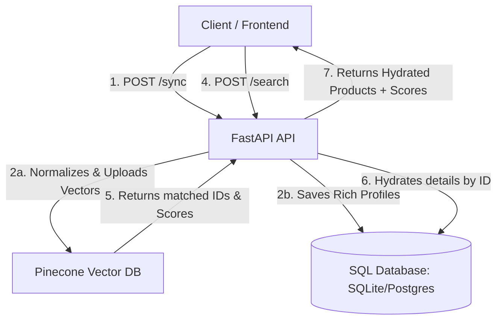

# Implementation Plan - Phase 5: SQL Database Persistence & Metadata Hydration

This plan outlines the architecture and execution steps for building Phase 5 of the **SourcingPlus Visual Search Backend**. It focuses on integrating an SQL relational database to store full product metadata and hydrating visual search results with detailed product sheets.

## Goal Description
Build a relational metadata layer to augment the vector database (Pinecone):
1. **SQL Database Engine**: Integrate **SQLAlchemy** ORM using **SQLite** as the default storage engine (with support for external databases like PostgreSQL via a `DATABASE_URL` environment variable).
2. **Metadata Extension**: Add rich product fields (e.g., `title`, `description`, `brand`, and `product_url`) to the catalog sync endpoint.
3. **Data Persistence**: Save full product profiles in the SQL database during the `/sync` operation, matching the primary key `id` with the Pinecone vector ID.
4. **Metadata Hydration**: Retrieve visual match IDs from Pinecone, query the SQL database to fetch their complete profiles (brand, description, title, etc.), and return the hydrated product sheets with their similarity scores.

---

## Technical Architecture



---

## User Review Required

> [!IMPORTANT]
> **New Dependencies**
> We will add `sqlalchemy` to `requirements.txt`. SQLite is built into Python, meaning no external database servers need to be installed or run in your Codespace.

> [!TIP]
> **Data Hydration Fallback**
> If a product ID returned by Pinecone is not found in the SQL database (for example, if it was indexed in Phase 1 before the SQL database was set up), the API will gracefully fall back to returning the metadata stored in Pinecone (SKU, price, category, inventory) and place placeholder values in the new fields (`title`, `brand`, etc.). This guarantees backward compatibility.

---

## Open Questions

> [!WARNING]
> 1. **Default Database Path**: We will default to a local SQLite file named `sourcingplus.db` in the project root. This database file will be added to `.gitignore` so it is not committed to GitHub. Is this acceptable?

---

## Proposed Changes

### Component: Database Configuration & Models

#### [NEW] [app/database.py](file:///c:/Users/GarciaJ26/OneDrive - AkzoNobel/Mundial - Documents/DASHBOARDS & KPI´s/SourcingPlus-VisualSearch-Backend/app/database.py)
Sets up the SQLAlchemy engine, session maker, and DB helper session dependencies.

#### [NEW] [app/models.py](file:///c:/Users/GarciaJ26/OneDrive - AkzoNobel/Mundial - Documents/DASHBOARDS & KPI´s/SourcingPlus-VisualSearch-Backend/app/models.py)
Defines the `Product` SQLAlchemy model mapping the SQLite database table columns.

---

### Component: Schemas & API Endpoints

#### [MODIFY] [app/schemas.py](file:///c:/Users/GarciaJ26/OneDrive - AkzoNobel/Mundial - Documents/DASHBOARDS & KPI´s/SourcingPlus-VisualSearch-Backend/app/schemas.py)
*   Update `ProductItem` schema to include optional fields: `title`, `description`, `brand`, and `product_url`.
*   Update `SearchResponseItem` schema to return these rich metadata fields.

#### [MODIFY] [app/api/endpoints.py](file:///c:/Users/GarciaJ26/OneDrive - AkzoNobel/Mundial - Documents/DASHBOARDS & KPI´s/SourcingPlus-VisualSearch-Backend/app/api/endpoints.py)
*   Inject database session dependency `db: Session = Depends(get_db)`.
*   Update `/sync` to write data to both Pinecone and the SQL database.
*   Update `/search/file` and `/search/url` to perform Pinecone queries and hydrate results from the SQL database.

---

### Verification and Testing

#### [NEW] [tests/test_database.py](file:///c:/Users/GarciaJ26/OneDrive - AkzoNobel/Mundial - Documents/DASHBOARDS & KPI´s/SourcingPlus-VisualSearch-Backend/tests/test_database.py)
Unit tests for database session initialization, product creation, and reads.

#### [MODIFY] [tests/test_search.py](file:///c:/Users/GarciaJ26/OneDrive - AkzoNobel/Mundial - Documents/DASHBOARDS & KPI´s/SourcingPlus-VisualSearch-Backend/tests/test_search.py)
Update search tests to assert that query results contain hydrated fields like `title`, `brand`, and `product_url`.

---

## Verification Plan

### Automated Tests
Run pytest in the workspace:
```bash
python -m pytest -v
```
Verify that all tests pass, confirming DB integration and database schema creation.
